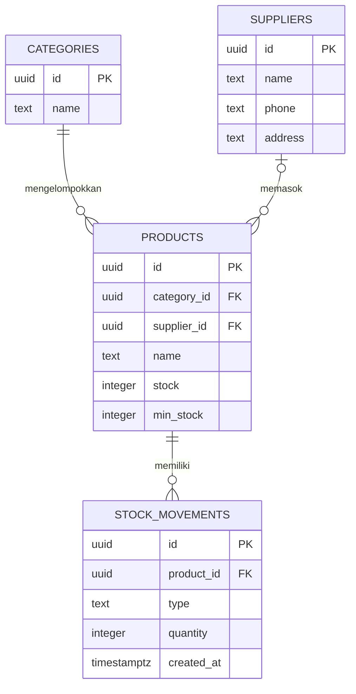

# Sistem Persediaan Giovani Sukses

Aplikasi persediaan toko buah dengan frontend HTML/CSS/JavaScript, backend Node.js tanpa dependensi tambahan, dan Supabase PostgreSQL.

## Struktur

```text
frontend/
  index.html
  styles.css
  app.js
backend/
  app.js
  schema.sql
README.md
```

## ERD



## Persiapan Supabase

1. Buat project Supabase, lalu buka **SQL Editor** dan jalankan seluruh isi `backend/schema.sql`. Untuk database yang sudah dipakai aplikasi sebelumnya, jalankan kembali file ini agar tabel dan fungsi transaksi penjualan yang baru ditambahkan tersedia; tabel lama tidak dihapus atau diganti.
2. Project URL dan Published Key yang diberikan sudah menjadi konfigurasi default backend. Published Key (sebelumnya disebut `anon` key) memang dirancang untuk aplikasi klien; jangan gunakan `service_role` key.
3. Gunakan Node.js 18 atau lebih baru. Dari folder proyek, jalankan server.

PowerShell:

```powershell
node backend/app.js
```

Untuk mengganti konfigurasi tanpa mengedit source, set `SUPABASE_URL` dan `SUPABASE_PUBLISHED_KEY` di environment sebelum menjalankan server.

Buka http://localhost:4173. Port bisa diubah dengan variabel `PORT`.

## Fitur

- Dashboard persediaan, nilai stok, penjualan hari ini, dan peringatan restok.
- Pencarian, filter kategori/status, pengurutan, dan CRUD produk.
- CRUD pemasok dan kategori, transaksi penjualan, serta mutasi stok.
- Penjualan mengurangi stok dan mencatat transaksi serta mutasi secara atomik di PostgreSQL; stok yang tidak mencukupi ditolak.
- Laporan penjualan harian, mingguan, bulanan, produk terlaris, dan distribusi stok per kategori.

## Catatan akses data

Skema starter ini memberi akses baca/tulis ke role `anon` agar aplikasi dapat langsung digunakan tanpa autentikasi. Kebijakan tersebut cocok untuk uji coba lokal, bukan produksi: siapa pun yang memperoleh Published Key dapat mengakses data project sesuai kebijakan ini. Sebelum dipakai untuk operasional, tambahkan Supabase Auth dan ganti kebijakan RLS menjadi berbasis pengguna/role. Published Key bukan rahasia; jangan pernah menaruh `service_role` key di frontend atau membagikannya.